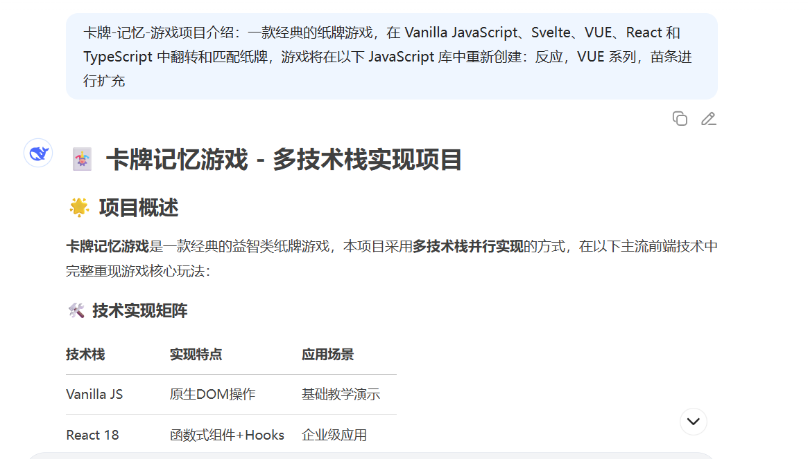
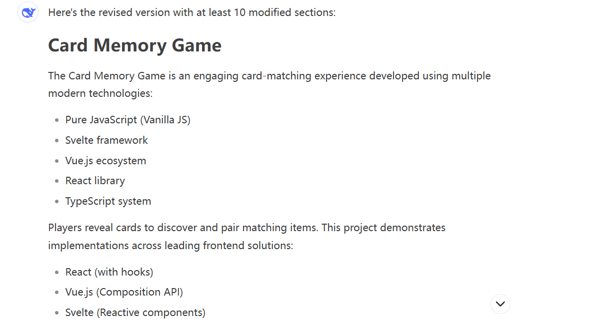
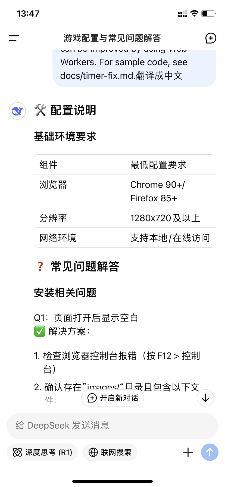
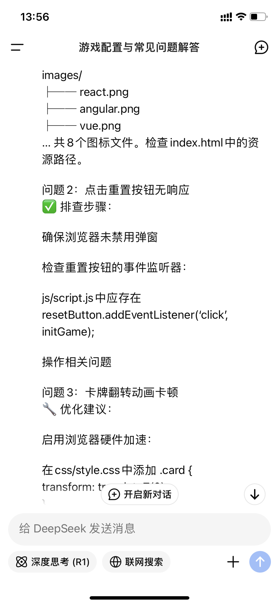
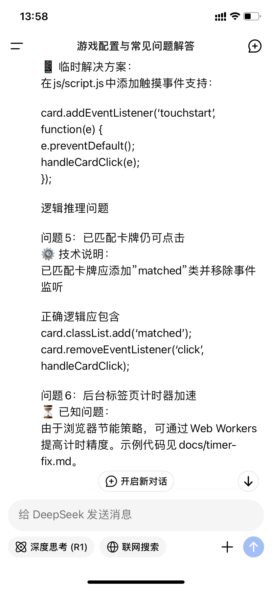

## 📮 项目主要功能说明与截图

```markdown

```
## 第一次ai修改
在git上得到了相应的游戏项目介绍让ai进行扩充得到了卡牌记忆游戏是一款经典的翻牌配对游戏然后将两者相结合就得到了我的第一次提交的项目介绍。

## 第二次ai修改
```markdown

```
根据ai搜索可以知道项目特点是什么在这个基础上我进行了扩充

## 第三次ai修改
```markdown

```
根据图片可以知道我让ai对第一次提交的内容进行10处修改，然后自己再进行润色得到第二次提交的内容。

<!-- by qinhaixia  -->

## Screenshot 1:  translate
  
*Translated English into Chinese using AI*

## Screenshot 2:  How can replacement function cases be resolved if they become ineffective
  
*Added event binding verification and compatibility testing issues on the basis of question 2*

## Screenshot 3: How to operate defensive and balance measures  
  
*Added defensive programming solutions and performance balancing suggestions on the original basis*

<!--by zhouxian-->


## 第一次AI使用记录

- 使用内容:将翻译后的中文文档和翻译前的英文文档提交给豆包，让豆包分析翻译的效果。
- 详细内容如图22053080103091所示

## 第二次AI使用记录

- ·使用内容:将具体段落提交给豆包，使用豆包进行翻译润色
- 详细内容如图2205308010309 2所示

## 第三次AI使用记录

- 使用内容:使用豆包MCP，绑定个人github仓库，让豆包分析项目的同时，分析文档翻译是否到位以及优缺点
- 详细内容如图22053080103093所示

<!-- by liyueying -->


以下是五个技术术语的中英文对照及解释：  

1. **`querySelectorAll`**  
   - **中文**：DOM 元素选择方法  
   - **英文**：A DOM method that selects all elements matching a specified CSS selector and returns a NodeList.  
   - **解释**：用于通过 CSS 选择器获取文档中所有匹配的元素，返回一个静态的 `NodeList` 集合。  

2. **`classList`**  
   - **中文**：HTML 元素的类名操作接口  
   - **英文**：An interface for manipulating the class attributes of an HTML element.  
   - **解释**：提供 `add()`、`remove()`、`toggle()` 等方法，用于动态修改元素的 CSS 类名。  

3. **`addEventListener`**  
   - **中文**：事件监听方法  
   - **英文**：A method to attach an event handler to an element.  
   - **解释**：为指定的 DOM 元素绑定事件（如 `click`、`keydown`），触发时执行回调函数。  

4. **`setTimeout`**  
   - **中文**：定时器函数  
   - **英文**：A function that executes a callback after a specified delay (in milliseconds).  
   - **解释**：用于延迟执行代码，属于 JavaScript 的异步编程工具。  

5. **`dataset`**  
   - **中文**：HTML5 自定义数据属性访问方式  
   - **英文**：An interface to access custom data attributes (`data-*`) of an element.  
   - **解释**：通过 `element.dataset.key` 读写元素上以 `data-` 开头的自定义属性。  
   
   这些术语是 **Web 前端开发** 中的核心概念，涵盖 DOM 操作、事件处理和异步行为控制。

